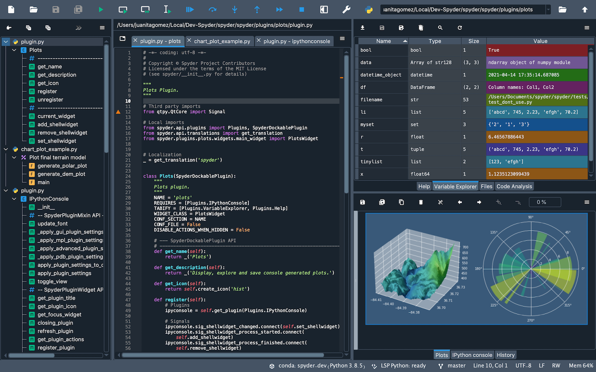

# Welcome to Spyder's Developer Documentation



Spyder is a powerful scientific environment written in Python, for Python, and designed by and for scientists, engineers and data analysts. It works as a Desktop application developed in Qt and thanks to its new API it is composed of semi-independent plugins.


## Where to go now

Spyder's developers documentation offers a wide variety of resources that will guide you from the very basic steps of contributing to Spyder, to Plugin creation.

1) Learn how to contribute to Spyder
  -Introduction (development environment)
2) Learn how Spyder's API works
  -Terminology-Dictionary (terminology)
  -Codebase Introduction: How is Spyder's code structured? (codebase_orientation)
  -Plugins and widgets in Spyder (extension_developer-guide)
  -??Dependency graphs? (new_api)
3) Learn how to write a plugin for Spyder
  -Introduction to Qt
  -Using cookiecutter
  -Plugin tutorial (plugin_tutorial_1)
  -Design patterns
4) Sample plugins
  -Workshop 1
  -Plugins examples
5) FAQ

```{toctree}
:caption: Contents
:maxdepth: 1
Introduction <introduction>
Spyder's terminology <terminology>
Codebase Introduction <codebase_orientation>
API Elements <api_elements>
Qt Introduction <qt_introduction>
Cookiecutter <plugin_cookiecutter>
The first plugin <plugin_tutorial_1>
Plugin Development with Spyder <plugin_development>
Extending Spyder <common_extension_points>
Design Patterns <design_patterns>
FAQ <faq>
```
