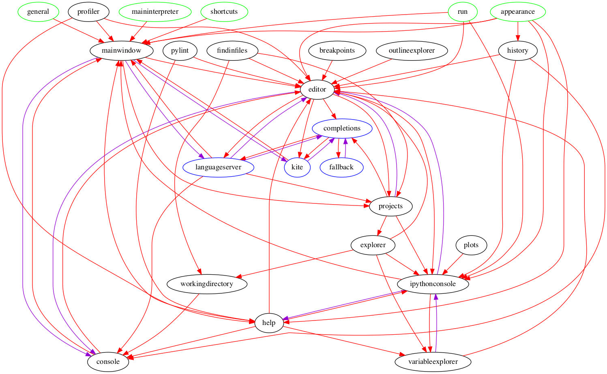
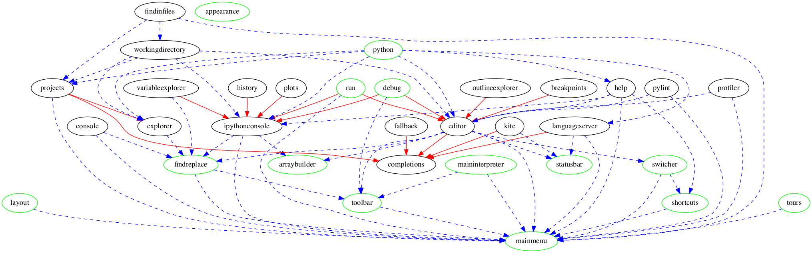

# The new API

This document will try to give an explanation of why Spyder 5 incurred in a
major refactoring of the codebase and redefinition of its plugin API.

## The guiding principles

### A. Loosely copupled components

Spyder should be provide a set of loosely coupled components with a clear
hierarchy and dependency instead from a tightly coupled monolith.
This means that some plugins have REQUIRED dependencies that must be
present for the plugin to be able to be loaded, and there are OPTIONAL
dependencies, that will not prevent the plugin from starting and working
with other plugins.

### B. Same workflow for internal and external plugins

Spyder should be written in the same way any external developer would, when
extending or creating a third party Spyder Plugin. This way anyone
developing external plugins can help the core codebase since it will look
and feel esencially the same.

### C. Simple and clear API

Spyder should provide 1 way and 1 way only for handling plugins, that means
that even if plugins are providing very different functionality, the basic
principles for creating, registering, setting up, loading, closing and
accessing the configuration system should be the same for all.

### D. Simple tooling

Spyder should provide enough tools, mixins and facilities for internal and
external developers as to reduce the amount of work needed to create and
extend a plugin and reduce the need for duplicating code in different
places of the codebase.

## 4.x dependency graph

- **Red lines**: represent hard dependencies, if the plugin is not available Spyder fails to start.
- **Purple lines**: represent circular dependencies, plugins that depend on each other.
- **Green nodes**: represent pseudo plugins, using special cases handling.
- **Blue nodes**: represent a diferent type of plugin, not following the API.
- **Black nodes**: Current plugins.

## 5.x dependency graph

- **Red lines**: represent hard dependencies, if the plugin is not available the plugin will not load (but spyder can start).
- **Purple lines**: There are no circular dependencies.
- **Green nodes**: represent NEW plugins, which come from the pseudo plugins or splitting functionality living in the mainwindow.
- **Blue dashed lines**: represent optional dependencies. Some functionality of the loaded plugin will not be available, but Spyder still starts.

## Issues solved so far

* Move the collections explorer out from the variable explorer and into the
  global `spyder.widgets.collectionseditor` module. [See #12726](https://github.com/spyder-ide/spyder/pull/12726).

* Migrate the Internal Console to use the new API. [See #12438](https://github.com/spyder-ide/spyder/pull/12438).

## Pending work

### Unclear extension

### Circular dependencies

### Different type of plugins

### Different type of preferences handling

### Naming conventions

### Configuration handling

## Work

### Remove circular dependencies among plugins

TODO:

### Only access configuration for REQUIRED and OPTIONAL dependencies

TODO:

### Fix mixins that require custom `__init__` calls

TODO:

### Fix signal names

TODO:

### The Spyder main application

TODO:

### The plugin interface

TODO:

#### Plugin

TODO:

### Main Containers

TODO:

#### Main Widgets

TODO:
