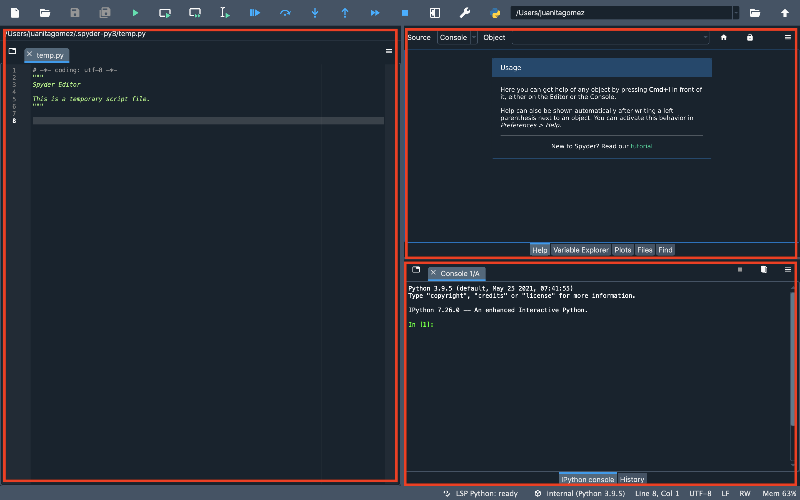
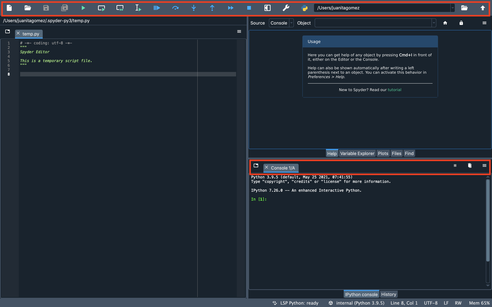
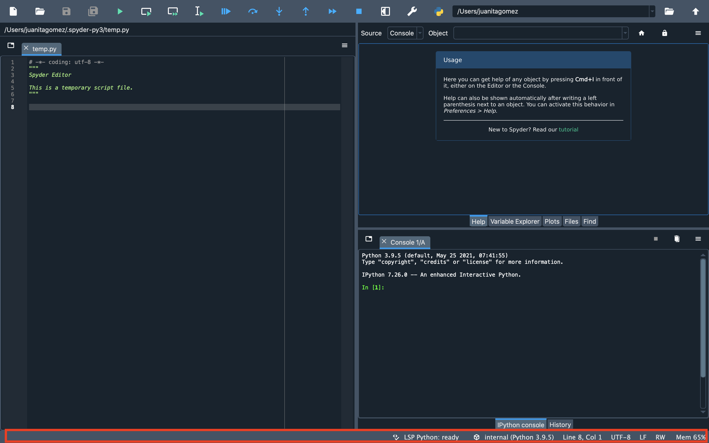
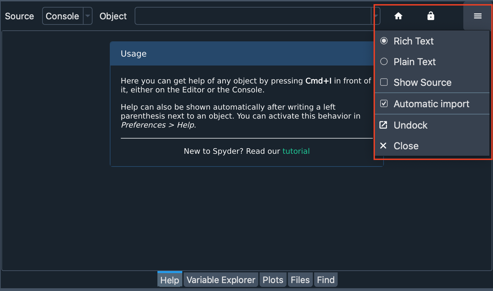
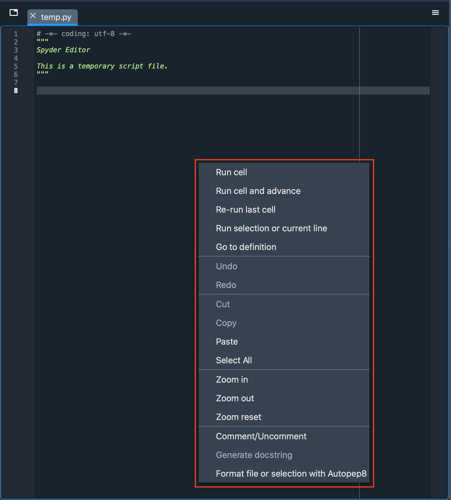
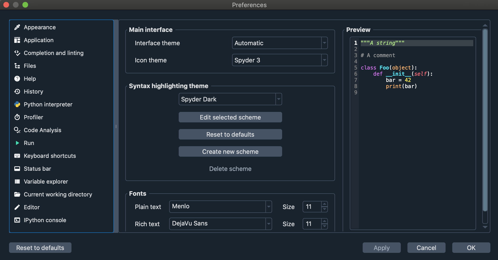

# Terminology

We provide a glossary of elements that you will find around Spyder's interface in order for you to get familiar with terminology around documentation.

## Application

User program which comprehends plugins, widgets, toolbars and other UI elements.

## Main Window

Graphic representation of the application. It is what users see by default when the application is launched.

## Panes

Rectangular sections in which the Spyder's interface is divided. These include the Editor, IPython Console, Help, etc...

## Toolbars

Graphical control with buttons that allow several actions throughout the interface.

In Spyder, there is main toolbar at the top of the application and several toolbars in each pane.

## Status bar

One of Spyder's toolbars, located at the bottom of the application which displays information about current Python environment, git branch, memory usage and various attributes of the currently active file.

## Options Menu

Dropdown menu in each Spyder pane that is shown when clicking the top left button. It contains useful settings and actions relevant to the pane.

## Context Menu

Dropdown menu in each Spyder pane that is shown when right clicking anywhere over the pane. It shows actions relevant to the element under your cursor.

## Plugin

A piece of software code that enables an application to perform an specific function. In Spyder, plugins are toolbars, menus, status bar widgets, custom and preferences dialogs.

## Widget

Separated graphical elements that are handled by plugins to extend its functionality.

## Preferences

Options provided by the application to customize several functions or panes.

## Tests

Program that allows finding errors within an application.

## Dependencies

Specific library that perform specific tasks within an application.

## Utils

Functions that allow the application to run processes that don't require graphical elements.

